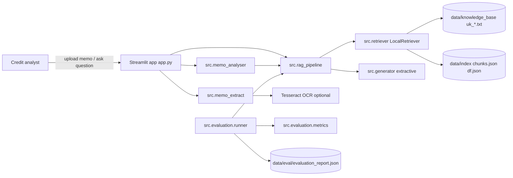
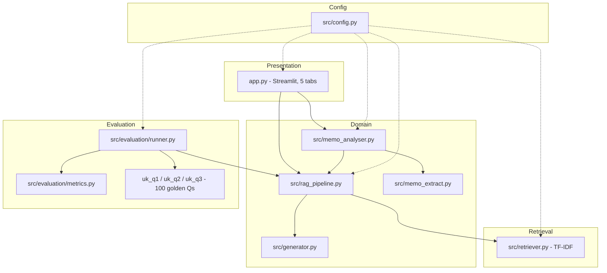
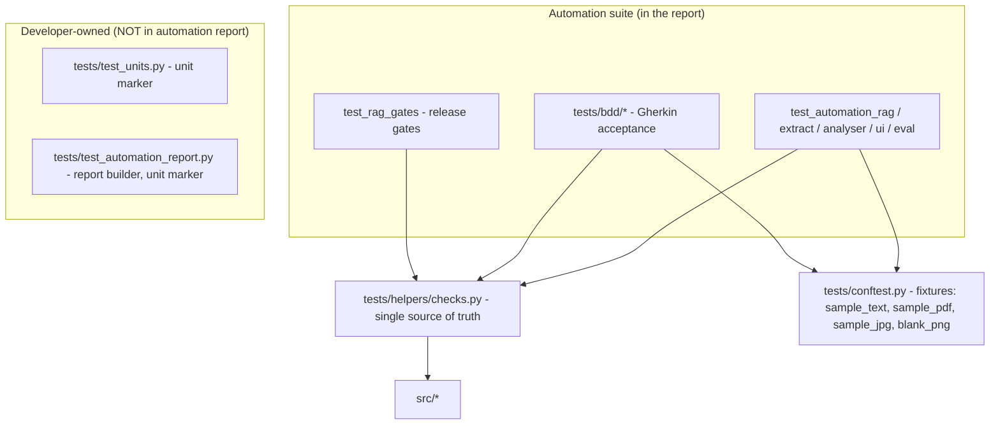
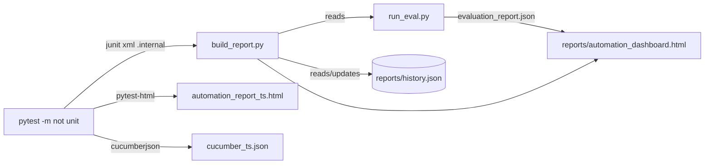

# Architecture

> Audience: engineers, reviewers and new joiners. This document explains **what the system is**,
> **how it is put together**, and **how the automation suite and reports are wired**.

## 1. What the system is

**UK Credit Memo AI** is a fully local, offline Retrieval-Augmented Generation (RAG) demo for UK
banking credit memos, aligned to FCA/PRA public standards. It has two jobs:

1. **Analyse a user's credit memo** against a UK-standards knowledge base (KB) and score readiness.
2. **Answer questions** over the UK KB with grounded, cited answers.

Design constraints that shape the architecture:

- **Offline / no cloud, no API keys** — retrieval is local TF-IDF, generation is extractive.
- **UK-standards-only KB** — user memos are *never* indexed (no data leakage).
- **Deterministic** — no LLM judge, so metrics and tests are reproducible.
- **Testable** — every layer is importable and testable headlessly (no browser needed).

## 2. System context



## 3. Layered architecture



The **test suite** and the **report builder** are first-class layers too — see §5 and §6.

## 4. Components and responsibilities

| Layer | Module | Responsibility |
|---|---|---|
| Presentation | `app.py` | Streamlit UI with 5 tabs: Analyse My Memo, Ask UK Standards, Knowledge Base (UK only), Evaluation Dashboard, Fine-tune. |
| Domain | `src/memo_extract.py` | Extract text from PDF/JPG/JPEG/PNG/TXT/MD. Digital PDF via `pypdf`; scanned PDF/image via Tesseract OCR (`pypdfium2` render). Returns `(text, method)` with actionable errors. |
| Domain | `src/memo_analyser.py` | Score a memo against an **8-point UK checklist** (Consumer Duty, affordability, IFRS 9, security, covenants, conduct, financial crime, guarantees). Produces `overall_score`, `verdict`, `checklist`, `gaps`, `standards_evidence`. |
| Domain | `src/rag_pipeline.py` | Orchestrates retrieval + generation. `get_retriever()` (load or build index), `rebuild_index()`, `ask(query, k)` -> answer + citations + contexts + latency. |
| Retrieval | `src/retriever.py` | Local **TF-IDF** retriever with chunking (size 900, overlap 150), persisted to `data/index/`. No network. |
| Domain | `src/generator.py` | **Extractive** grounded generator: only emits sentences from retrieved context (keeps faithfulness high, hallucination low by construction). |
| Evaluation | `src/evaluation/runner.py` | Runs the 100-question golden set end-to-end; computes metrics; writes `evaluation_report.json` with per-question rows and a PASS/FAIL verdict. |
| Evaluation | `src/evaluation/metrics.py` | Deterministic offline metrics: Recall@K, Precision@K, MRR, Hit@K, Faithfulness, Correctness, Answer relevance, Hallucination, percentile latency. |
| Evaluation | `src/evaluation/uk_q1|q2|q3.py` | Golden dataset: 35 + 35 + 30 = **100** UK questions with gold doc + expected keywords. |
| Config | `src/config.py` | Paths, `TOP_K`, chunking, `KB_GLOB` (`uk_*.txt`) and `THRESHOLDS` (release gates). |

## 5. Test & automation architecture



Key idea: **`tests/helpers/checks.py` is the single source of truth.** Both the imperative tests
and the BDD step definitions call the same helper functions (e.g. `index_uk_kb()`, `ask_uk()`,
`analyse_file()`), so there is **no duplicated logic** between styles.

## 6. Reporting architecture



- `run_automation.py` chains: `run_eval.py` -> `pytest -m "not unit"` -> `build_report.py`.
- `build_report.py` parses the JUnit feed, loads the eval report, appends to the rolling
  `reports/history.json`, and renders a **single self-contained HTML** dashboard
  (inline SVG charts + CSS, no CDN) showing Pass/Fail/Skipped pie, KPI cards, RAG gauges,
  **last 3 runs**, and a searchable/filterable table of automation cases.
- The JUnit XML is an **internal feed** (`reports/.internal/`), not a user-facing deliverable.

## 7. Data flows

**Ask flow:** `ask(q,k)` -> `get_retriever()` -> `search()` (TF-IDF top-k chunks) ->
`generate_answer()` (extractive sentence selection) -> `{answer, citations, contexts, latency_s}`.

**Memo analysis flow:** `analyse_memo(file|text)` -> `extract_memo_text()` (text/OCR) ->
`_score()` against the 8 checklist groups -> status PASS/REVIEW/GAP -> UK-grounded evidence via
`ask()` probes -> `{overall_score, verdict, checklist, gaps, standards_evidence}`.

**Evaluation flow:** `runner.run(k)` -> for each of 100 golden Qs -> `ask()` -> compute metrics ->
aggregate + gate checks -> `evaluation_report.json` + PASS/FAIL verdict.


## 8. Repository map

```
RAGAutomation/
├── app.py                     # Streamlit UI (5 tabs)
├── run_eval.py                # 100-Q RAG evaluation only
├── run_automation.py          # one-command automation: eval + tests + reports + dashboard
├── build_report.py            # builds the visual dashboard from the JUnit feed + eval report
├── pytest.ini                 # markers + testpaths
├── requirements.txt
├── src/
│   ├── config.py              # paths, TOP_K, THRESHOLDS, KB_GLOB
│   ├── retriever.py           # local TF-IDF retriever (chunk + index)
│   ├── generator.py           # extractive grounded generator
│   ├── rag_pipeline.py        # retrieve -> generate orchestration
│   ├── memo_extract.py        # PDF/image/text extraction (+OCR)
│   ├── memo_analyser.py       # 8-point UK checklist scoring
│   ├── evaluation/            # metrics.py, runner.py, uk_q1/q2/q3.py, build_dataset_p*.py
│   └── reporting/             # report_builder.py (visual dashboard generator)
├── tests/
│   ├── conftest.py            # shared fixtures
│   ├── helpers/checks.py      # single source of truth for test helpers
│   ├── test_units.py          # developer UNIT tests (unit marker) - excluded from report
│   ├── test_automation_*.py   # automation tests (rag/extract/analyser/ui/eval/report)
│   ├── test_rag_gates.py      # release gates
│   └── bdd/                   # Gherkin features + step definitions
├── data/
│   ├── knowledge_base/        # uk_*.txt (15 UK standards docs)
│   ├── memos/                 # user memos (NEVER indexed)
│   ├── index/                 # persisted TF-IDF index
│   └── eval/                  # evaluation_report.json, test_dataset_100.json
├── reports/                   # automation_dashboard.html, pytest-html, cucumber, history.json
│   └── .internal/             # junit feed (machine-readable, not a deliverable)
└── docs/                      # this documentation set
```

## 9. Design decisions and trade-offs

| Decision | Why | Trade-off |
|---|---|---|
| Local TF-IDF retrieval | Offline, deterministic, zero cost, testable | Lower recall than embeddings on paraphrases (mitigated by golden-set tuning) |
| Extractive generator | Faithfulness ~1.0, hallucination ~0 by construction | Answers are terse/verbatim, not fluent |
| No LLM judge in eval | Reproducible, no API keys, fast gates | Metrics are lexical heuristics, not semantic grading |
| UK-only KB via `uk_*.txt` glob | Prevents non-UK docs and memo leakage | New KB docs must follow the `uk_` naming |
| `tests/helpers/checks.py` shared | DRY; BDD and imperative tests stay in sync | Helpers must stay stable/backward-compatible |
| Unit tests separated by `unit` marker | Automation report stays automation-only | Two selection modes to remember (`pytest -q` vs `-m "not unit"`) |
| JUnit XML as internal feed | Robust numeric durations/results for the dashboard | One extra (hidden) artifact under `reports/.internal/` |

## 10. Extension points

- **New KB document:** add `data/knowledge_base/uk_16_*.txt`, rebuild the index (KB tab or
  `rebuild_index()`), and add a golden Q to `src/evaluation/uk_q*.py` + a BDD/automation test.
- **New automation check:** add a test in `tests/test_automation_*.py` (or a `.feature` under
  `tests/bdd/features/`), reuse a helper from `tests/helpers/checks.py`, tag it with an existing
  marker, and add a `_CATEGORY_RULES` entry in `src/reporting/report_builder.py` if it is a new area.
- **New metric/gate:** add to `src/evaluation/metrics.py`, wire into `runner.py`, add the threshold
  to `THRESHOLDS` in `src/config.py`, then add a gate test in `tests/test_rag_gates.py` and an
  entry to `_EVAL_METRICS`/`_GATE_KEYS` in the report builder.
- **New report section:** extend `src/reporting/report_builder.py` (chart helper + template slot + CSS).

